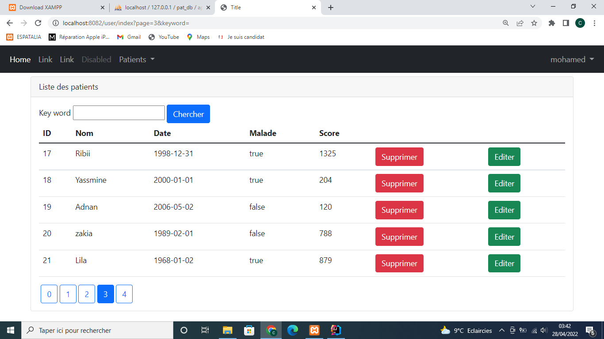
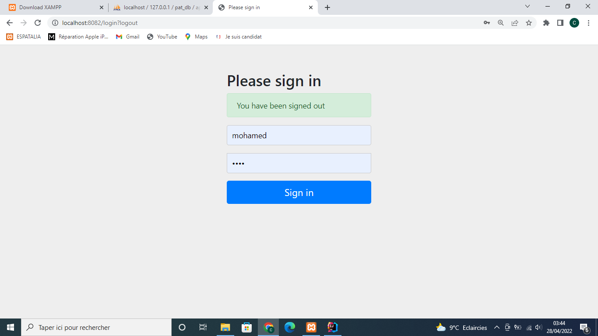
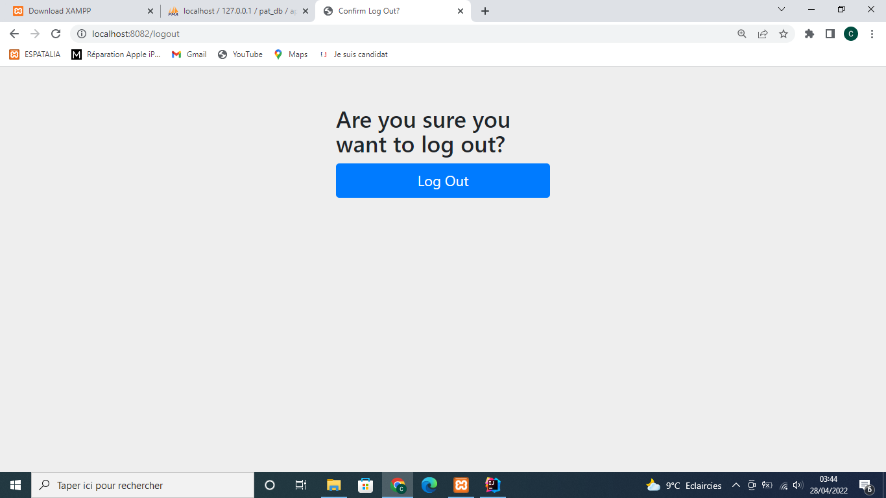
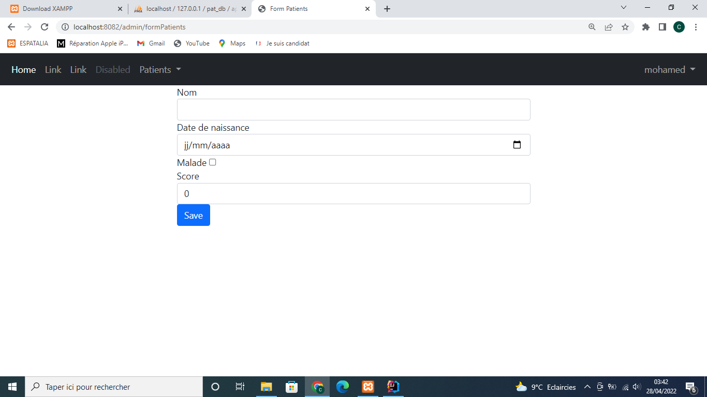
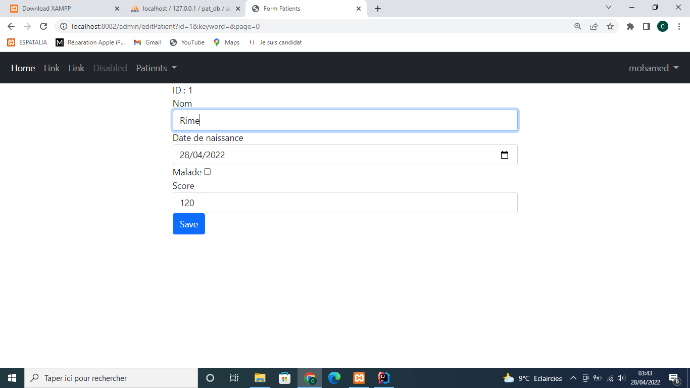
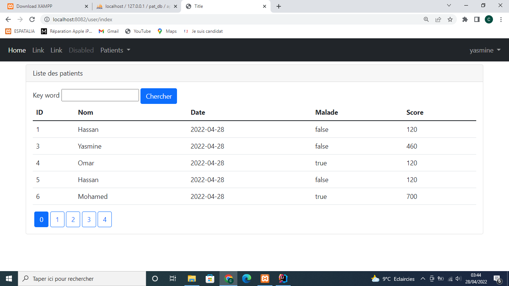

# Gestion des patients : JEE 
<h2 xmlns="http://www.w3.org/1999/html"> I- Spring MVC, Thymeleaf, Spring Data et Spring Security</h2>

<h2 style="text-decoration: underline;">1- objectif:</h2>

Développer une application web baseé sur Sprint MVC, ThymeLeaf et Spring Data qui permet de gérer des patients.

L' Application doit permettre de : 

<ul>
<li> Chercher des Patients avec Pagination. </li>
<li> Supprimer un Pateint. </li>
<li> Ajouter un Payient avec validation du formulaire. </li>
<li> Modifier et Mettre A jour un Patient. </li>
<li> Créer une page Template basée sur Thymeleaf Layout. </li>
</ul>

<h2 style="text-decoration: underline;">2- Diagram de Class :</h2>

<h2 style="text-decoration: underline;">3- Travail à faire : </h2>

<ol type="1">

<dt><li> Créer un projet Spring Boot avec les dépendances </li></dt>
<dd>Spring DATA JPA , H2, Web ,themeleaf st Lombok </dd>
<dt><li>Créer La couche DAO</li></dt>
<dd>
<ul>
<li>Cree l'entite jpa Patient</li>
<li>Créer L'interface Patient Repository basée sur Spring DAta </li>
<li>Tester la couche Dao</li>
</ul> 
</dd>
<dt><li>Créer la couche web </li></dt>
<ul>
<dd><li> Créer le controleur Spring MVC</li>
<li>Créer les vue basee sur le moteur de Templates Thymeleafe </li>
</dd>
</ul>
</ol>

<h2 style="text-decoration: underline;">4- Présentation de l'application : </h2>
Dans cette image on trouve la liste des patients avec pagination (Partie Admin).

 
<h2> II- Spring Security : Spring Boot Spring MVC Thymeleaf Spring Securiry User Details Service: </h2>

            <h2 style="text-decoration: underline;"> 1- Objectif :</h2>
        

            Sécuriser L'accés a l'Application 
            qui permet de géer les Patients en utilisant Spring Security . L'accées à L'aplication nécessite une Authentification avec
            un Username et mot de passe .un utilisateur peut avoir plusieurs Role ;
        

        <dl>
          <h4>ROLE_USER:</h4>
          <dd >-permettant de chercher des patients</dd>
          <h4>Role_ADMIN</h4>
          <dd>- permettant d'ajouter, mettre àajour et supprimer les patients</dd>
        </dl>

<h2 style="text-decoration: underline;">2- Travail a faire : </h2>

 

<ol type="1">
  <li>Ajouter la dépendance maven de Spring Security.  </li>
  <li>Personnaliser la configuration de Spring Security Suivantes avec la Startégie InMemoryAuthentication. 

<ul>
  <li> Auhtentification avec le Role USER pour pouvoir Consulter Les Patients. </li>
  <li> Authentification Avec le role ADMIN pour pouvoir Ajouter, Modifier, Mettre à  jour et supprimer des Patients. </li>
  <li> Permettre l'accés aux ressources statique (/webJars/**) sans aucune authentification. </li> 
</ul>
</li>

<li> Basculer de La Statégie InMemory Authentification Vers JDBCD Authentification </li>
<li>Basculer Vers La Stratégie UserDetailsService </li>

</ol>

<h2 style="text-decoration: underline;">3- Présentation de l'application :</h2>

Pour la page de login , on peut voir le formulaire de login avec les champs username et password

Après qu'on clique sur le boutton Logout , un message de confirmation s'affiche comme celui ci.

Aprés authentification, et si le user a le role ADMIN, il peut ajouter, editer, supprimer des patients.

Alors pour un utilisateur avec le role USER, il ne peut que consulter les patients.

